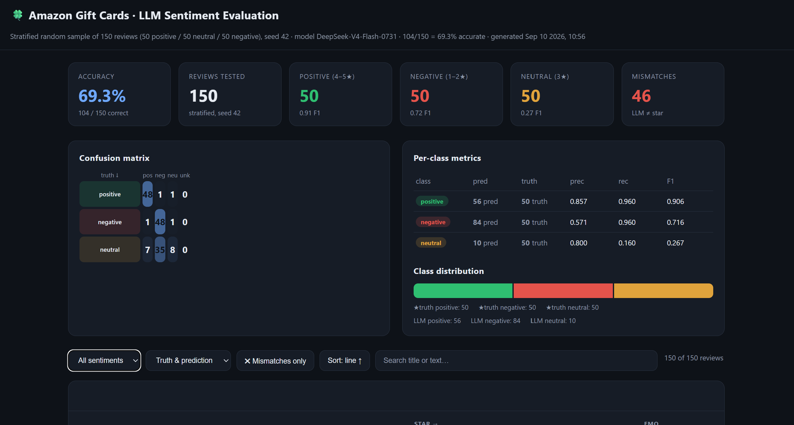

# LLM Sentiment & Emotion Classification of Amazon Gift Card Reviews

This project classifies **Amazon Gift Cards** product reviews using a large language
model, and evaluates the model's predictions against the reviewers' **1–5 star
ratings** as ground truth. It uses the **Amazon 2023 Reviews dataset** (McAuley
Lab `Amazon_2023`, Gift Cards category; ~152,410 reviews).

The model is served by a local **vLLM / DeepSeek-V4-Flash-0731** instance, accessed
through an **OpenAI-compatible endpoint**. For each review, the LLM predicts a
*sentiment class* (**positive / neutral / negative**) and a *primary emotion* from
the **title and text only**. Star ratings are **never** used for classification — they
are held out strictly to *test* the model.

The predictions are also compared against the **NRC Emotion Lexicon (EmoLex v0.92)** —
an established English word → emotion dictionary — to see whether the LLM's emotion
matches the lexicon-derived emotion of the same text.


*Interactive evaluation dashboard (self-contained HTML — sort, filter, and search).*

---

## Key results

To give every class a fair test, the evaluation used a **stratified random sample of
150 reviews: 50 positive, 50 neutral, 50 negative** (reproducible, `seed = 42`).

| Class | Actual (star) | Predicted (LLM) | Recall | F1 |
|---|--:|--:|--:|--:|
| Positive (4–5★) | 50 | 56 | **96%** | 0.91 |
| Negative (1–2★) | 50 | 84 | **96%** | 0.72 |
| Neutral (3★) | 50 | 10 | **16%** | 0.27 |

- **Overall sentiment accuracy: 104 / 150 = 69.3%**
- **Emotion agreement (LLM primary vs NRC-derived): 36 / 119 = 30.3%**

### Interpretation

- **Positive and negative reviews are classified very well** (96% recall each).
- **Neutral is the model's blind spot.** A text-only model finds 3-star reviews (e.g.
  *"works but could be simpler"*, *"fairly nice"*) genuinely hard, and the LLM pushed
  **35 of the 50 neutral reviews into the negative class** and 7 into positive —
  visible in the "predicted vs actual" chart as the large gap at *neutral*.
- The model **over-predicts negative** (84 predicted vs 50 actual) and
  **under-predicts neutral** (10 predicted vs 50 actual).
- On emotion, a free-form LLM label and a raw lexicon word-count agree only ~30% of
  the time — reflecting that lexical frequency and semantic judgment are different
  measures of emotion.

---

## Method / pipeline

1. **Sample** – draw a reproducible stratified sample from `Gift_Cards.jsonl.gz`
   (`50` from each star-truth class, `seed = 42`).
2. **LLM classification** – for each review, send `title` + `text` to the
   OpenAI-compatible endpoint and ask for `{"sentiment", "emotion"}` (DeepSeek-V4).
   Parse and validate the reply.
3. **NRC emotion scoring** – tokenize the same text and tally which NRC emotions the
   words carry; take the dominant emotion. Map the LLM's free-form emotion onto the
   8 NRC categories where possible.
4. **Evaluation** – compare LLM sentiment vs star-truth accuracy (confusion matrix,
   precision / recall / F1) and LLM emotion vs NRC-derived emotion.
5. **Dashboard** – render everything into a single, self-contained HTML page.

### Star → class mapping (evaluation ground truth only)

| Star rating | Class |
|---:|---|
| 4 – 5 | `positive` |
| 3 | `neutral` |
| 1 – 2 | `negative` |

---

## Reproduction

Requires **Python 3.10+** (standard library only). Set the endpoint:

```bash
export ENDPOINT_URL=http://<host>:9000/v1
export ENDPOINT_KEY=<your-api-key>
export ENDPOINT_MODEL=DeepSeek-V4-Flash-0731
```

Windows (PowerShell):

```powershell
$env:ENDPOINT_URL="http://<host>:9000/v1"
$env:ENDPOINT_KEY="<your-api-key>"
$env:ENDPOINT_MODEL="DeepSeek-V4-Flash-0731"
```

**Evaluate the stratified 150-review sample (sentiment + emotion + NRC):**

```bash
python collect_eval_data.py --per-class 50 --seed 42
python render_dashboard.py
# open dashboard.html in any browser
```

**Other scripts:**

```bash
python sentiment_classifier.py            # classify first N reviews (original, sentiment only)
python evaluate_sentiment.py --n 100 --seed 42   # evaluate sentiment vs star truth
python fixup_unknowns.py                  # retry empty/malformed LLM replies
```

---

## Repository contents

| File | Purpose |
|---|---|
| `dashboard.html` | Self-contained, interactive evaluation dashboard |
| `random100_eval.json` | Evaluated random-100 sample |
| `stratified150_eval.json` | Evaluated stratified 50/50/50 sample (150 reviews) |
| `Gift_Cards.jsonl.gz` | Amazon 2023 review dataset, Gift Cards category |
| `nrc_emotions.py` | NRC lexicon loader, dominant-emotion scorer, emotion mapper |
| `nrc/NRC-lexicon-v0.92.txt` | NRC Emotion Lexicon v0.92 (word-level) |
| `collect_eval_data.py` | Stratified sampling + LLM sentiment/emotion classification |
| `render_dashboard.py` | Builds `dashboard.html` from the JSON data |
| `sentiment_classifier.py` | Original sentiment-only classifier |
| `evaluate_sentiment.py` | Sentiment-vs-star-truth evaluation (confusion matrix, PRF) |
| `fixup_unknowns.py` | Re-classifies empty/invalid LLM replies |
| `assets/dashboard_screenshot.png` | Screenshot used in this README |

---

## References

- Amazon 2023 Reviews dataset (McAuley Lab): https://amazon-reviews-2023.github.io/
- NRC Emotion Lexicon (EmoLex): Mohammad & Turney (2010, 2013), National Research
  Council Canada — word → 8 emotions + positive/negative. Version 0.92.
